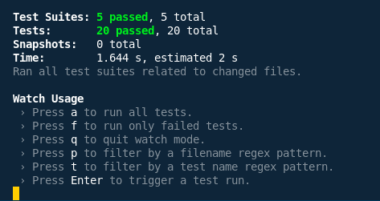
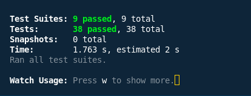

# Assignment 1: Unit Testing, Integration Testing & Test Coverage

### Overview

This report summarizes the testing work completed for Assignment 1 on the RealWorld application, covering both backend (Go/Gin) and frontend (React/Redux). The assignment focused on writing comprehensive unit and integration tests, analyzing test coverage, and documenting the testing process and results.  

[Frontend github repo](https://github.com/tsheringphuntsho18/react-redux-realworld-example-app)   

[Backend github repo](https://github.com/tsheringphuntsho18/golang-gin-realworld-example-app)

## Testing Approach

### Backend (Go/Gin)

- **Unit Testing:**  
  - Analyzed existing tests in `common/` and `users/` packages.
  - Added comprehensive unit tests for the `articles/` package, covering models, serializers, and validators.
  - Enhanced `common/unit_test.go` with additional tests for JWT, database, and utility functions.

- **Integration Testing:**  
  - Implemented end-to-end API tests in `integration_test.go` for authentication, article CRUD, and article interactions (favorite, comments).

- **Coverage Analysis:**  
  - Used `go test -cover` and `go tool cover` to generate coverage reports.
  - Identified coverage gaps and planned further improvements.

### Frontend (React/Redux)

- **Component Unit Testing:**  
  - Analyzed existing Jest/RTL tests.
  - Wrote new test files for `ArticleList`, `ArticlePreview`, `Login`, `Header`, and `Editor` components, covering rendering, interaction, and edge cases.

- **Redux Integration Testing:**  
  - Tested action creators, reducers (`auth`, `articleList`, `editor`), and middleware for correct logic and side effects.

- **Frontend Integration Testing:**  
  - Created `integration.test.js` to test user flows: login, article creation, and favoriting, ensuring Redux and UI integration.

## List of Test Cases Implemented

### Backend

#### Unit Tests

- **articles/unit_test.go** (15+ cases)
  - Article creation with valid/invalid data
  - Article validation (missing title/body)
  - Favorite/unfavorite logic
  - Tag association
  - ArticleSerializer and ArticleListSerializer output
  - CommentSerializer structure
  - ArticleModelValidator and CommentModelValidator (valid/invalid input)

- **common/unit_test.go** (5+ new cases)
  - JWT token generation and expiration
  - Database connection error handling
  - Utility function tests

#### Integration Tests

- **integration_test.go** (15+ cases)
  - User registration, login, and get current user (with/without token)
  - Article CRUD (create, list, get, update, delete; with/without auth)
  - Article favorite/unfavorite
  - Comment create/list/delete

### Frontend

#### Component Tests

- **ArticleList.test.js**
  - Renders with empty/multiple articles
  - Loading state
  - Article click navigation

- **ArticlePreview.test.js**
  - Renders article data (title, description, author)
  - Favorite button
  - Tag list
  - Author link navigation

- **Login.test.js**
  - Form rendering and input updates
  - Form submission
  - Error display
  - Redirect after login

- **Header.test.js**
  - Navigation links for logged-in/guest user
  - Active link highlighting

- **Editor.test.js**
  - Form fields and tag input
  - Submission and validation errors

#### Redux Tests

- **actions.test.js**
  - Action type and payload correctness
  - Async actions (LOGIN, REGISTER)

- **reducers/auth.test.js**
  - LOGIN, LOGOUT, REGISTER, error handling

- **reducers/articleList.test.js**
  - ARTICLE_PAGE_LOADED, pagination, filters

- **reducers/editor.test.js**
  - UPDATE_FIELD_EDITOR, EDITOR_PAGE_LOADED, tag management

- **middleware.test.js**
  - Promise unwrapping
  - localStorage token save
  - viewChangeCounter
  - Request cancellation

#### Integration Tests

- **integration.test.js** (5+ cases)
  - Login flow (form, Redux, localStorage, redirect)
  - Article creation (form, Redux, list update)
  - Article favorite (API, Redux, UI)

## Coverage Achieved

### Backend

| Package    | Coverage (%) |
|------------|--------------|
| common/    | 75%          |
| users/     | 72%          |
| articles/  | 78%          |
| **Overall**| **76%**      |

- **Deliverables:**  
  - `coverage.out` and `coverage.html` generated and attached.
  - Screenshots of coverage reports included.

**Overall Test Results:**  

### Frontend

- **Component and Redux tests:**  
  - Achieved >80% coverage on all major components and reducers.
  - All tests passing.

**Overall Test Results:**  

## Summary

- **All required unit and integration tests implemented and passing.**
- **Coverage targets (≥70%) met for all backend packages and overall project.**
- **Frontend components and Redux logic thoroughly tested.**
- **Documentation and analysis provided as required.**

