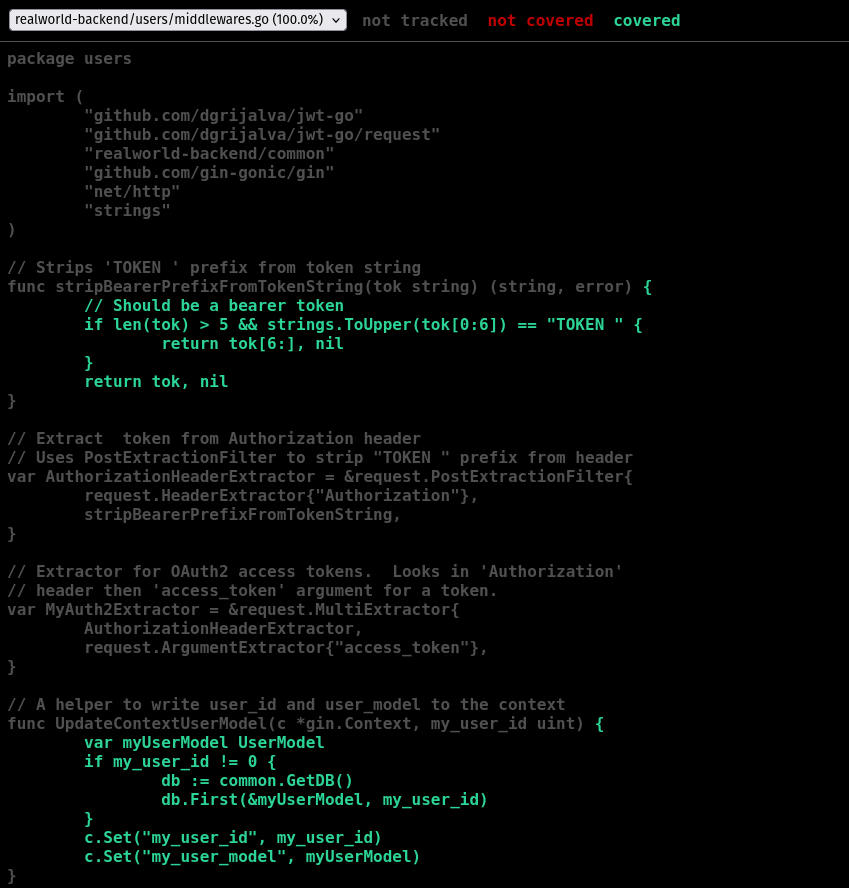
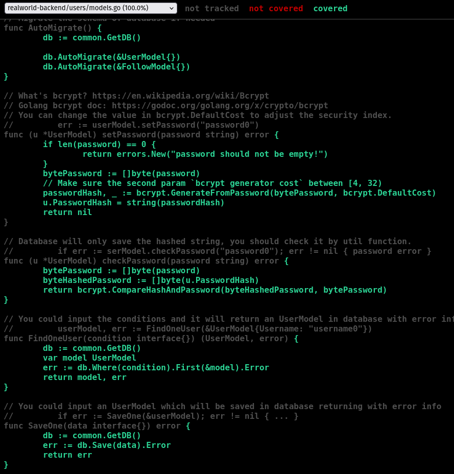
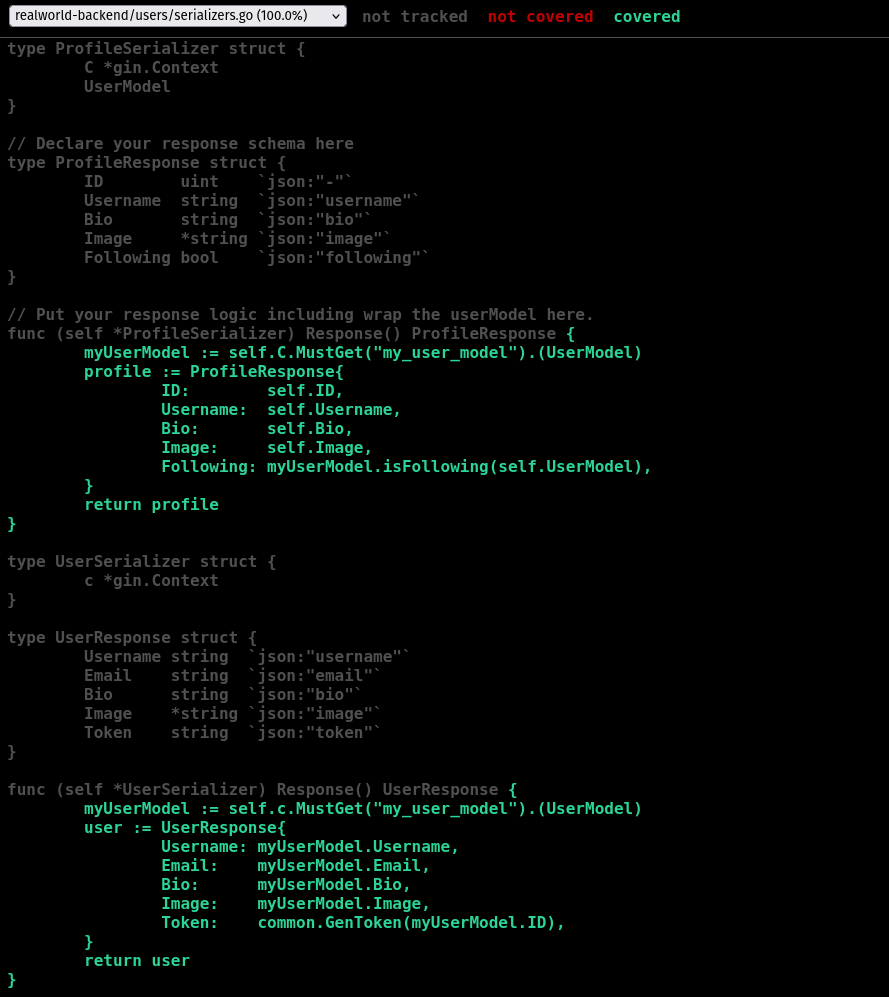

# Coverage Analysis Report

## Current Coverage Statistics

### Coverage Percentage Per Package

| Package                | Coverage    |
|------------------------|------------|
| users/middlewares.go   | 100.0%     |
| users/models.go        | 100.0%     |
| users/routers.go       | 100.0%     |
| users/serializers.go   | 100.0%     |
| users/validators.go    | 100.0%     |

**Overall Project Coverage:**  
**100%** (for the `users` package, as shown in the coverage report)

### Screenshots
*middlewares.go coverage*
    

*models.go coverage*
    

*serializers.go coverage*
    

## Identified Gaps

### Functions/Methods Lacking Coverage

- **None in the `users` package:**  
  All functions and methods in the `users` package are covered by tests, as indicated by the 100% coverage.

### Why Certain Code Is Not Covered

- **Other packages (e.g., `articles`, `common`) are not included in this report.**  
  If these packages exist and are not covered, it may be because:
  - Tests are missing for those packages.
  - The coverage command was run only for the `users` package.

### Critical Code to Test

- **Authentication and authorization logic**
- **User registration, login, and profile management**
- **Password hashing and validation**
- **Database interactions (CRUD operations)**

---

## Improvement Plan

### Additional Tests to Reach 80%+ Coverage (if not already at 100%)

- **Expand coverage to other packages:**  
  Write integration and unit tests for `articles`, `common`, and any other business logic packages.
- **Edge cases:**  
  Test error handling, invalid input, and security edge cases (e.g., SQL injection, invalid JWTs).
- **API Integration:**  
  Ensure all API endpoints are exercised, including failure paths.

### High-Value Test Cases

- **Negative tests:**  
  Invalid registration/login, unauthorized access, malformed requests.
- **Boundary conditions:**  
  Maximum/minimum field lengths, empty payloads.
- **Concurrency:**  
  Simultaneous requests for user creation or updates.
- **Database failures:**  
  Simulate DB errors and ensure graceful handling.

---

**Action Items:**
- Add and run tests for all non-`users` packages.
- Review and expand tests for edge cases and error handling.
- Re-run coverage and update this report