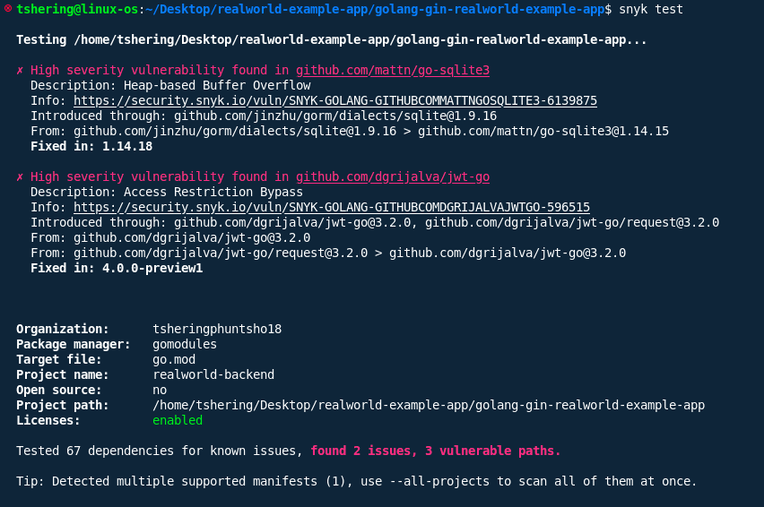
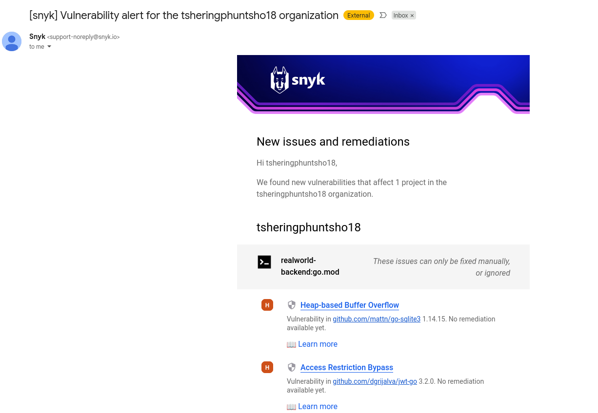

## Vulnerability Summary

- **Total number of vulnerabilities found:** 3 vulnerable dependency paths (2 unique vulnerabilities)
- **Breakdown by severity:**
  - **Critical:** 0
  - **High:** 3
  - **Medium:** 0
  - **Low:** 0
- **List of affected dependencies:**
  - `github.com/dgrijalva/jwt-go@3.2.0`
  - `github.com/dgrijalva/jwt-go/request@3.2.0`
  - `github.com/mattn/go-sqlite3@1.14.15` (via `github.com/jinzhu/gorm/dialects/sqlite@1.9.16`)

## Critical/High Severity Issues

### 1. Access Restriction Bypass in github.com/dgrijalva/jwt-go

- **Severity:** High
- **Package:** github.com/dgrijalva/jwt-go
- **Version:** 3.2.0
- **CVE:** CVE-2020-26160
- **Vulnerability type:** Access Restriction Bypass (CWE-287)
- **Description:**  
  Affected versions are vulnerable to Access Restriction Bypass if the `aud` claim is an empty string array (`[]string{}`), causing audience verification to succeed even if the audiences are incorrect and `required` is set to `false`.
- **Exploit scenario:**  
  An attacker could craft a JWT with an empty audience claim, potentially bypassing audience checks and gaining unauthorized access to protected resources.
- **References:**  
  - [GitHub Issue](https://github.com/dgrijalva/jwt-go/issues/422)
  - [GitHub PR](https://github.com/dgrijalva/jwt-go/pull/426)
- **Recommended fix/upgrade path:**  
  Upgrade to `github.com/dgrijalva/jwt-go@4.0.0-preview1` or higher.  
  **Note:** This library is no longer maintained. Consider migrating to [`github.com/golang-jwt/jwt`](https://github.com/golang-jwt/jwt).

### 2. Heap-based Buffer Overflow in github.com/mattn/go-sqlite3

- **Severity:** High
- **Package:** github.com/mattn/go-sqlite3
- **Version:** 1.14.15
- **CVE:** CVE-2023-7104
- **Vulnerability type:** Heap-based Buffer Overflow (CWE-122)
- **Description:**  
  Vulnerable versions allow a heap-based buffer overflow via the `sessionReadRecord` function in `ext/session/sqlite3session.c`. An attacker can cause a crash or execute arbitrary code by manipulating input.
- **Exploit scenario:**  
  If an attacker can control input to the affected function, they may crash the application or execute arbitrary code.
- **References:**  
  - [GitHub Commit](https://github.com/mattn/go-sqlite3/commit/9fd6f4ffd3430f64ec35c64063b59af680582e11)
  - [SQLite Issue](https://sqlite.org/forum/forumpost/5bcbf4571c)
- **Recommended fix/upgrade path:**  
  Upgrade to `github.com/mattn/go-sqlite3@1.14.18` or higher.

## Dependency Analysis

- **Direct vs transitive dependencies:**
  - `github.com/dgrijalva/jwt-go` and `github.com/dgrijalva/jwt-go/request` are direct dependencies.
  - `github.com/mattn/go-sqlite3` is a transitive dependency via `github.com/jinzhu/gorm/dialects/sqlite`.
- **Outdated dependencies:**
  - Both affected packages are outdated and have patched versions available.
  - `github.com/dgrijalva/jwt-go` is deprecated; migration to `github.com/golang-jwt/jwt` is recommended.
- **License issues:**  
  No license violations detected in the current Snyk output.

## Summary Table

| Vulnerability Type           | Package                                 | Version   | Severity | CVE           | Direct/Transitive | Fix/Upgrade Path         |
|------------------------------|-----------------------------------------|-----------|----------|---------------|-------------------|--------------------------|
| Access Restriction Bypass    | github.com/dgrijalva/jwt-go            | 3.2.0     | High     | CVE-2020-26160 | Direct            | 4.0.0-preview1+ or migrate|
| Heap-based Buffer Overflow   | github.com/mattn/go-sqlite3            | 1.14.15   | High     | CVE-2023-7104  | Transitive        | 1.14.18+                 |

**Action Items:**
- Upgrade or replace `github.com/dgrijalva/jwt-go` (preferably migrate to `github.com/golang-jwt/jwt`).
- Upgrade `github.com/mattn/go-sqlite3` to at least version 1.14.18.
- Review all transitive dependencies for further updates and security

## Screenshots

Include relevant screenshots of the Snyk scan results and vulnerability details below for reference:

