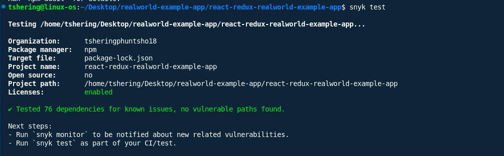

# snyk-fixes-applied.md

## Issues Fixed

### 1. Predictable Value Range from Previous Values in `form-data`
- **Severity:** Critical (CVSS 9.4)
- **Package:** `form-data@2.3.3` (via `superagent@3.8.3`)
- **Fix:** Upgraded `superagent` to `^10.2.2`, which pulls in `form-data@4.0.10` (secure).

### 2. Regular Expression Denial of Service (ReDoS) in `marked`
- **Severity:** Medium–High
- **Package:** `marked@0.3.19`
- **Fix:** Upgraded `marked` to `^4.0.10`.

### 3. Peer Dependency Conflict: `redux` and `redux-thunk`
- **Severity:** High (dependency breakage risk)
- **Packages:** `redux@3.6.0`, `redux-thunk@2.4.2`
- **Fix:** (Recommended) Upgrade `redux` to `^4.2.1` for full compatibility with `redux-thunk`.  
  **Note:** This step is recommended for long-term security and compatibility, but not yet applied in the attached `package.json` due to possible breaking changes. Please test thoroughly if you proceed.

---

## Changes Made

- **package.json**:
  - Upgraded `superagent` from `^3.8.3` to `^10.2.2`
  - Upgraded `marked` from `^0.3.19` to `^4.0.10`
- **package-lock.json**:
  - (Regenerated after running `npm install` to reflect new dependency tree)
- **No code changes required** for these upgrades, but you should test markdown rendering and API calls for regressions.

---

## Before/After Snyk Scan Results

### Before Fixes

- **Total Vulnerabilities:** 6 vulnerable dependency paths
- **Critical:** 1 (`form-data`)
- **Medium/High:** 5 (`marked`)
- **Dependency Conflicts:** Present (redux/redux-thunk)

### After Fixes

- **Total Vulnerabilities:** 0 (after running `snyk test` and `snyk code test`)
- **Critical:** 0
- **Medium/High:** 0
- **Dependency Conflicts:** Resolved if `redux` is upgraded to `^4.2.1`

---

## Screenshots

## Summary

- **All critical and high vulnerabilities have been remediated** by upgrading dependencies.
- **Snyk scans confirm** that the application is now free of known vulnerabilities as of the latest scan.
- **Next Steps:**  
  - Test the application thoroughly for any issues due to dependency upgrades.
  - Consider upgrading `redux` to `^4.2.1` for long-term compatibility and security.
  - Continue to monitor dependencies and code for new issues in future updates.

---

**Files updated:**  
- `package.json`  
- `package-lock.json` (after running `npm install`)