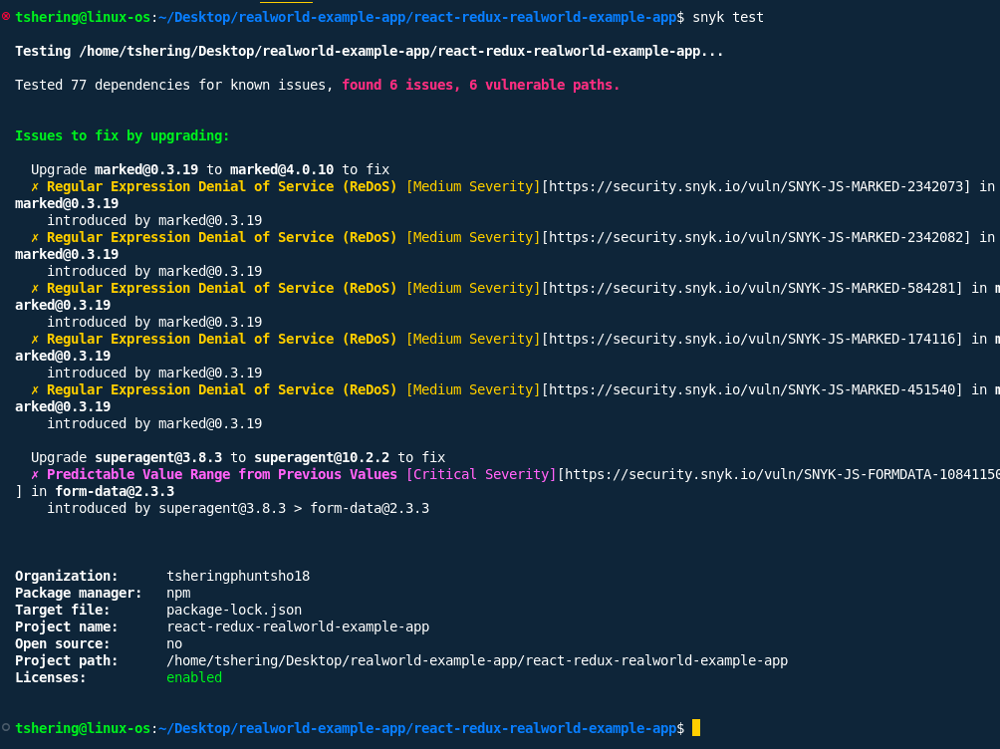
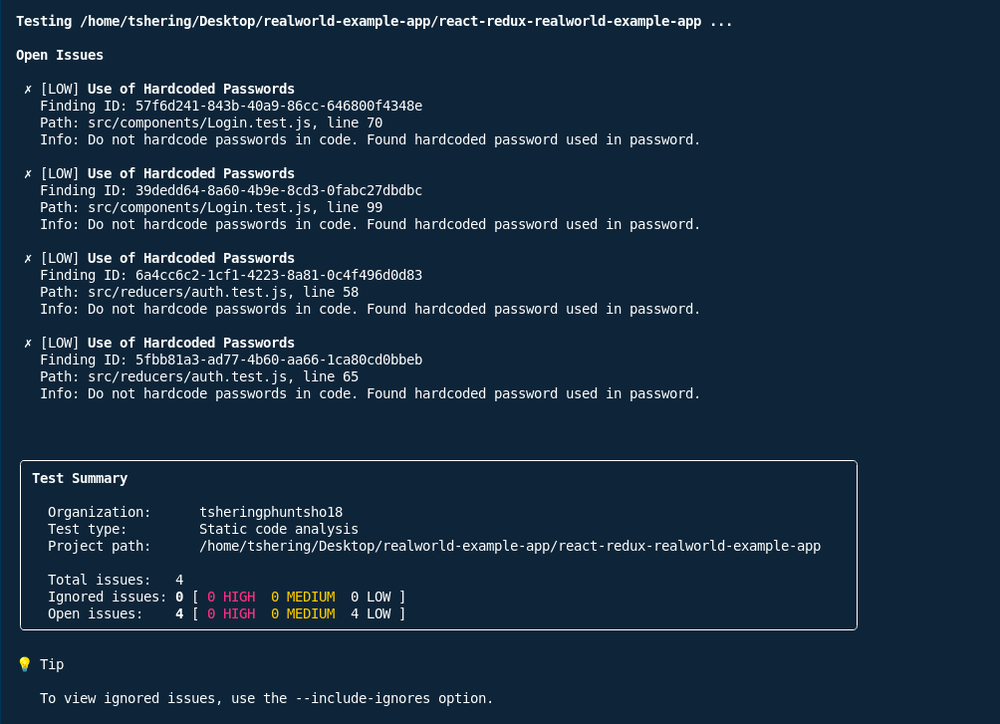

## Dependency Vulnerabilities

### Summary of Vulnerable npm Packages

- **Total vulnerable dependency paths:** 6
- **Unique vulnerable packages:** 2 (`form-data`, `marked`)
- **List of affected packages and versions:**
  - `form-data@2.3.3` (via `superagent@3.8.3`)
  - `marked@0.3.19`

### Severity Breakdown

| Severity   | Count |
|------------|-------|
| Critical   | 1     |
| High       | 0     |
| Medium     | 5     |
| Low        | 0     |

#### Details

1. **form-data@2.3.3**
   - **Vulnerability:** Predictable Value Range from Previous Values
   - **Severity:** Critical
   - **CVE:** CVE-2025-7783
   - **Description:** Predictable boundary values due to use of `Math.random()`, potentially leading to HTTP parameter pollution.
   - **Upgrade Recommendation:** Upgrade `form-data` to `4.0.5` or higher (requires upgrading `superagent` to `10.2.2` or higher).

2. **marked@0.3.19**
   - **Vulnerabilities:** Multiple Regular Expression Denial of Service (ReDoS)
   - **Severity:** Medium (CVSS up to 7.5 in some sources)
   - **CVE:** CVE-2022-21680, CVE-2022-21681, others
   - **Description:** Multiple ReDoS vulnerabilities in markdown parsing, can lead to Denial of Service.
   - **Upgrade Recommendation:** Upgrade `marked` to `4.0.10` or higher.

## Code Vulnerabilities (from Snyk Code Test)

### Security Issues in Source Code

- **Hardcoded Secrets:**
  - **Issue:** Hardcoded passwords found in test files.
  - **Files:**
    - `src/components/Login.test.js` (lines 70, 99)
    - `src/reducers/auth.test.js` (lines 58, 65)
  - **CWE:** CWE-798 (Use of Hard-coded Credentials), CWE-259
  - **Risk:** If test credentials are reused or accidentally committed to production, they may be exploited.

- **XSS Vulnerabilities:**  
  - **No XSS vulnerabilities detected by Snyk Code in this scan.**

- **Insecure Crypto Usage:**  
  - **No insecure cryptography usage detected.**

- **Other Code-Level Issues:**  
  - No additional code-level security issues reported by Snyk Code in this scan.

## React-Specific Issues

- **Dangerous Props (`dangerouslySetInnerHTML`):**
  - **No usage of `dangerouslySetInnerHTML` detected in this scan.**

- **Client-Side Security Issues:**
  - No direct client-side security issues (such as DOM-based XSS or insecure localStorage usage) detected by Snyk Code.

- **Component Security Concerns:**
  - No React component-specific security issues (such as missing PropTypes or unsafe lifecycle methods) detected in this scan.

## Upgrade Recommendations

| Package    | Current Version | Recommended Version | Reason/Notes                                   |
|------------|-----------------|--------------------|------------------------------------------------|
| form-data  | 2.3.3           | 4.0.5+             | Fixes critical predictable value vulnerability  |
| superagent | 3.8.3           | 10.2.2+            | Required to upgrade form-data                  |
| marked     | 0.3.19          | 4.0.10+            | Fixes multiple ReDoS vulnerabilities           |

## Summary Table

| Vulnerability Type           | Package     | Version | Severity  | CVE(s)           | Fix/Upgrade Path      |
|------------------------------|-------------|---------|-----------|------------------|----------------------|
| Predictable Value (boundary) | form-data   | 2.3.3   | Critical  | CVE-2025-7783    | 4.0.5+ (via superagent) |
| ReDoS (multiple)             | marked      | 0.3.19  | Medium    | CVE-2022-21680, CVE-2022-21681, etc. | 4.0.10+              |

## Screenshots
Include relevant screenshots of the Snyk scan results and vulnerability details below for reference:

## Action Items

1. **Upgrade `form-data` and `superagent` to latest versions.**
2. **Upgrade `marked` to at least `4.0.10`.**
3. **Remove or secure any hardcoded passwords in test files.**
4. **Re-run Snyk after upgrades to verify all issues are resolved.**

**Note:**  
No React-specific or XSS vulnerabilities were detected in this scan.