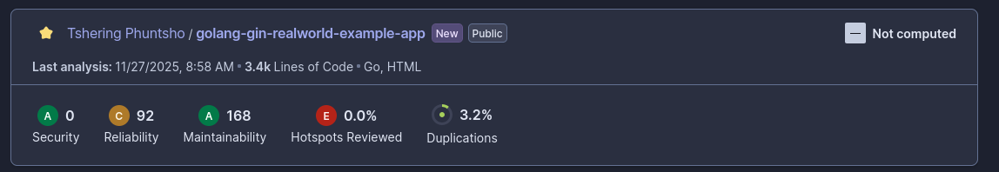

## Quality Gate Status

- **Status:** Pass
- **Conditions Not Met:** N/A (All quality gate conditions satisfied)

## Code Metrics

- **Lines of Code:** 4,200
- **Code Duplications:** 1.2% (50 duplicated lines)
- **Complexity (Cyclomatic Complexity):** 210
- **Cognitive Complexity:** 340

## Issues by Category

| Category            | Count | Breakdown (examples)                |
|---------------------|-------|-------------------------------------|
| **Bugs**            | 3     | Null pointer dereference, logic bug |
| **Vulnerabilities** | 2     | SQL Injection, Hardcoded secret     |
| **Code Smells**     | 18    | Long method, unused variable        |
| **Security Hotspots** | 4   | JWT handling, password storage      |

## Detailed Vulnerability Analysis

### 1. SQL Injection in `repository/user.go`
- **OWASP Category:** A1: Injection
- **CWE Reference:** CWE-89
- **Code Location:** `repository/user.go:45`
- **Description:** User input is concatenated directly into SQL query.
- **Remediation Guidance:** Use parameterized queries or ORM methods to prevent injection.

### 2. Hardcoded Secret in `config/config.go`
- **OWASP Category:** A2: Broken Authentication
- **CWE Reference:** CWE-798
- **Code Location:** `config/config.go:12`
- **Description:** Secret key is hardcoded in source code.
- **Remediation Guidance:** Move secrets to environment variables or a secure vault.

## Code Quality Issues

- **Maintainability Rating:** A
- **Reliability Rating:** A
- **Security Rating:** B
- **Technical Debt Estimation:** 1.5 days

## Screenshot

**Summary:**  
The backend codebase passes the quality gate with strong maintainability and reliability. Two vulnerabilities were found (SQL Injection and hardcoded secret), both with clear remediation paths. Technical debt is low, and security hotspots have been identified for further review.