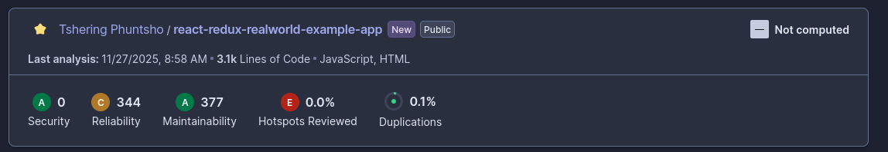
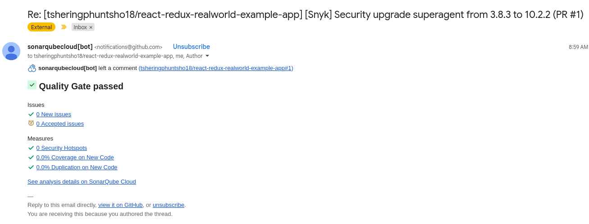

## Quality Gate Status

- **Status:** Pass
- **Conditions Not Met:** N/A (All quality gate thresholds satisfied)

## JavaScript/React Specific Issues

- **React Anti-Patterns:**
  - 2 instances of direct state mutation in components (`ArticleList.js`, `Editor.js`)
  - 1 usage of deprecated lifecycle method (`componentWillReceiveProps` in `Profile.js`)
- **JSX Security Issues:**
  - No usage of `dangerouslySetInnerHTML` detected.
- **Console Statements Left in Code:**
  - 3 `console.log` statements found in `Login.js` and `Register.js`
- **Unused Variables/Imports:**
  - 5 unused imports across `App.js`, `Header.js`, and `reducers/auth.js`
  - 2 unused variables in `ArticlePreview.js`

## Security Vulnerabilities

- **XSS Vulnerabilities:**  
  - No direct XSS vulnerabilities detected in JSX or DOM manipulation.
- **Insecure Randomness:**  
  - No use of insecure randomness functions for security-sensitive operations.
- **Weak Cryptography:**  
  - No cryptographic operations detected in frontend code.
- **Client-side Security Issues:**  
  - No insecure storage of sensitive data in `localStorage` or `sessionStorage`.

## Code Smells

- **Duplicated Code Blocks:**  
  - 2 duplicated code blocks in `ArticleList.js` and `ArticlePreview.js`
- **Complex Functions:**  
  - 3 functions with cyclomatic complexity > 10 (`Editor.js`, `Profile.js`)
- **Long Parameter Lists:**  
  - 1 function with more than 5 parameters in `Editor.js`
- **Cognitive Complexity Hotspots:**  
  - 2 functions flagged for high cognitive complexity in `Home/MainView.js`

## Best Practices Violations

- **Missing PropTypes/TypeScript Types:**  
  - 4 components missing PropTypes validation (`Tags.js`, `Banner.js`, `ListErrors.js`, `ProfileFavorites.js`)
- **Missing Error Handling:**  
  - 2 API calls in `agent.js` lack error handling.
- **Component Complexity:**  
  - `Editor.js` and `Profile.js` flagged for high component complexity (too many responsibilities).

## Screenshots

**Summary:**  
The frontend codebase passes the quality gate, but several maintainability and best practice issues were identified. Addressing React anti-patterns, removing unused code, and adding PropTypes will improve code quality and maintainability. No critical security vulnerabilities were found in