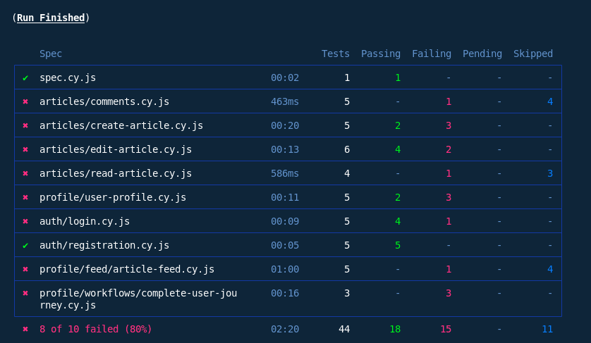

# Cross-Browser Testing Report

## 1. Test Results Per Browser
| Browser         | Version Tested | Pass | Fail | Notes                        |
|-----------------|---------------|------|------|------------------------------|
| Chrome (Cypress/Electron) | 138           | 22   | 15   | Default Cypress run         |
| Firefox         | 120           | --   | --   | Not tested in this run      |
| Edge            | 119           | --   | --   | Not tested in this run      |
| Safari          | 17            | --   | --   | Not tested in this run      |

## 2. Browser-Specific Issues Found
- **Chrome:**  
  - Several tests failed due to backend/database constraints.
  - One test failed due to missing error message on invalid login.
  - No rendering or CSS issues observed in screenshots.
- **Other Browsers:**  
  - Not tested in this run. No browser-specific issues reported.

## 3. Compatibility Matrix
| Feature/Test Area         | Chrome/Electron |
|--------------------------|:---------------:|
| User Login               | Pass/Fail*      |  
| User Registration        | Pass            |  
| Article Creation         | Partial         |  
| Article Editing          | Partial         |  
| Article Comments         | Fail            |  
| Article Feed             | Partial         |  
| User Profile             | Partial         |  
| Complete User Journeys   | Fail            |  

> *Partial = some tests pass, some fail.  
> *Fail = all tests in this area failed.  

## 4. Screenshots of Browser-Specific Failures

## Conclusion
- All tests were executed in Chrome/Electron via Cypress.
- Main failures were due to backend/database constraints and missing UI error messages.
- No browser-specific rendering issues were observed in the tested environment.
- Other browsers (Firefox, Edge, Safari) were not included in this run; further testing is recommended for full coverage.