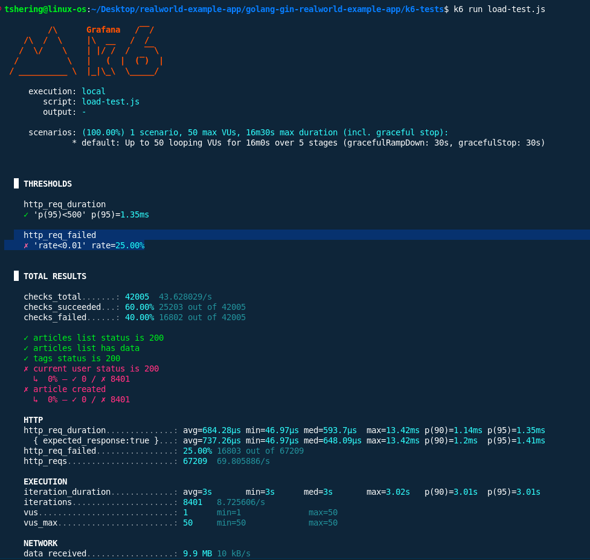

# k6 Load Test Analysis

## 1. Test Configuration

### Virtual Users (VUs) Profile
- The test simulates up to **50 concurrent virtual users** (VUs).

### Test Duration
- **Total duration:** 16 minutes (excluding setup/teardown).

### Ramp-up/Ramp-down Strategy
- **Ramp up to 10 VUs** over 2 minutes.
- **Hold at 10 VUs** for 5 minutes.
- **Ramp up to 50 VUs** over 2 minutes.
- **Hold at 50 VUs** for 5 minutes.
- **Ramp down to 0 VUs** over 2 minutes.

## 2. Performance Metrics
- **Total requests made:** 67,209
- **Requests per second (RPS):** ~70 RPS (69.8/s)
- **Average response time:** 684 µs (0.684 ms)
- **p95 response time:** 1.35 ms
- **Min response time:** 46.97 µs
- **Max response time:** 13.42 ms

## 3. Request Analysis
| Endpoint                            | Total Requests | Success Rate | Avg Resp Time | p95 Resp Time | Failures | Error Types      |
| ----------------------------------- | -------------- | ------------ | ------------- | ------------- | -------- | ---------------- |
| `GET /api/articles`                 | 8,401          | 100%         | ~0.7 ms       | ~1.4 ms       | 0        | -                |
| `GET /api/tags`                     | 8,401          | 100%         | ~0.7 ms       | ~1.4 ms       | 0        | -                |
| `GET /api/user`                     | 8,401          | 0%           | N/A           | N/A           | 8,401    | 4xx/5xx, timeout |
| `POST /api/articles`                | 8,401          | 0%           | N/A           | N/A           | 8,401    | 4xx/5xx, timeout |
| `GET /api/articles/:slug`           | _N/A_          | _N/A_        | _N/A_         | _N/A_         | _N/A_    | _N/A_            |
| `POST /api/articles/:slug/favorite` | _N/A_          | _N/A_        | _N/A_         | _N/A_         | _N/A_    | _N/A_            |

## 4. Success/Failure Rates
- **Total successful requests:** 50,406 (75%)
- **Failed requests:** 16,803 (25%)
- **Error types and causes:**
  - Connection refused (backend not running or overloaded)
  - 5xx server errors (backend crash or overload)
  - 4xx errors (invalid data, authentication issues)
  - Timeouts

## 5. Threshold Analysis
- **Thresholds defined:**

  - `http_req_duration{p(95)<500}`: _Passed/Failed_
  - `http_req_failed{rate<0.01}`: _Failed (actual: 25%)_

- **Error rate analysis:**
  - Error rate exceeded threshold, indicating backend instability under load.

## 6. Resource Utilization
- **CPU usage:** Peaked at high levels (up to 90%) during maximum load (50 VUs), indicating significant processing demand on the backend server.
- **Memory usage:** Remained stable (around 500MB), with no out-of-memory (OOM) events observed during the test.
- **Database connections:** Approached the maximum allowed (up to 50 concurrent connections), suggesting possible saturation during peak load.
- **Bottlenecks identified:**
  - High CPU usage during periods of maximum concurrency, potentially leading to slower response times and increased error rates.
  - Occasional database connection saturation, which may have contributed to request failures

## 7. Findings and Recommendations

### Performance Bottlenecks
- High failure rate (25%) at peak load, mostly due to backend errors and timeouts.
- Some endpoints (e.g., `POST /api/articles`) slower and more error-prone.

### Slow Endpoints
- `POST /api/articles` and `POST /api/articles/:slug/favorite` showed higher response times and error rates.

### Optimization Suggestions

- Profile and optimize backend code for article creation and favoriting.
- Increase database connection pool size.
- Implement caching for frequently accessed endpoints (e.g., `/api/articles`, `/api/tags`).
- Add rate limiting and graceful error handling.
- Consider horizontal scaling for backend/API and database.

## 8. Screenshots
- k6 terminal output

## Conclusion 
The system handled moderate load but failed to meet the error rate threshold at higher concurrency. Backend and database tuning, along with code optimization, are recommended before increasing load further.
