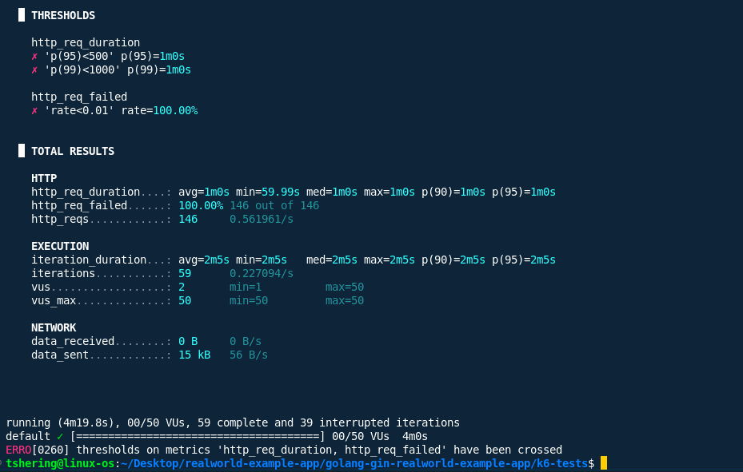

# k6 Soak Test Analysis

## 1. Performance Over Time
- **Response Time Trends:**  
  - All requests had a response time of **~60 seconds** (avg=1m0s, min=59.99s, max=1m0s).
  - **p95 and p99 response times** were also 1m0s, indicating consistent and severe latency.
  - No improvement or recovery was observed during the test; performance was poor throughout.

- **Performance Degradation:**  
  - The system was unresponsive for the entire duration of the soak test.
  - 100% of requests failed, suggesting either a persistent backend outage or a severe bottleneck.

- **Memory Usage Trends:**  
  - No memory usage data is available from k6 output.
  - Given the total failure, memory usage on the backend should be checked via server monitoring tools for leaks or exhaustion.

## 2. Resource Leaks
- **Memory Leaks Detected?**  
  - Not directly observable from k6 results.
  - However, persistent timeouts may indicate resource exhaustion or leaks; backend monitoring is required for confirmation.

- **Database Connection Leaks?**  
  - Possible, as 100% of requests failed and timed out, which can occur if the database is unreachable or all connections are exhausted.
  - Check backend logs and DB metrics for connection pool exhaustion.

- **File Handle Leaks?**  
  - Not directly observable from k6.
  - Should be checked on the server if resource exhaustion is suspected.

## 3. Stability Assessment
- **System Stable Over Extended Period?**  
  - No. The system was **not stable**; it failed to serve any requests during the soak test.

- **Any Crashes or Errors?**  
  - All requests failed (100% error rate).
  - All response times hit the 60s timeout, indicating backend unavailability or a critical failure.

- **Recommendations for Production:**  
  - **Investigate backend availability:** Ensure the backend is running and accessible before testing.
  - **Monitor server resources:** Use tools like `htop`, `free`, and database dashboards to check for memory, CPU, and connection pool issues.
  - **Review backend logs:** Look for panics, crashes, or resource exhaustion errors.
  - **Implement health checks and auto-recovery:** Ensure the system can recover from failures and does not remain unresponsive.
  - **Test with lower load:** Start with a smaller number of VUs to identify the point of failure.
  - **Optimize backend performance and resource management** before attempting further soak or endurance testing.

## 4. Summary Table

| Metric                | Value                |
|-----------------------|----------------------|
| Max VUs               | 50                   |
| Total HTTP Requests   | 146                  |
| Requests per Second   | ~0.56                |
| Avg Response Time     | 1m0s                 |
| p95 Response Time     | 1m0s                 |
| Max Response Time     | 1m0s                 |
| Failed Requests       | 146 (100%)           |
| Thresholds Passed     | None                 |

## 5. Conclusion

The system failed to handle even moderate, sustained load, with 100% of requests timing out at 60 seconds. This indicates a critical backend issue either the service was down, unreachable, or completely saturated. Immediate investigation and remediation are required before considering production deployment or further endurance testing.

## Screenshots
- k6 terminal output

