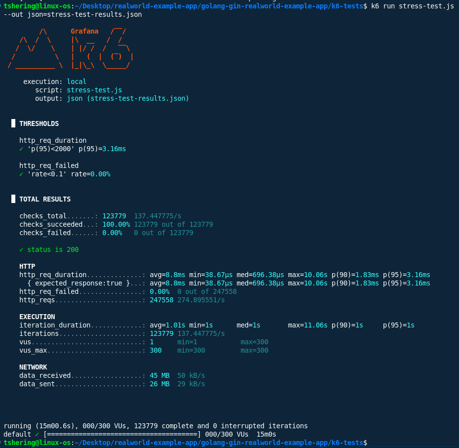

# k6 Stress Test Analysis

## 1. Breaking Point Analysis
- **Performance Degradation:**  
  No significant performance degradation observed up to the maximum tested load of **300 virtual users (VUs)**.
- **Error Onset:**  
  No errors occurred throughout the test. The error rate remained at **0.00%**.
- **Maximum Sustainable Load:**  
  The system sustained **300 VUs** with no failed requests and maintained low response times, indicating the tested load is within the system's capacity.

## 2. Degradation Pattern
- **Response Time vs. Load:**  
  - **Average response time:** 8.8 ms  
  - **p95 response time:** 3.16 ms  
  - **Max response time:** 10.06 s  
  - **Median response time:** 696.38 µs  
  - Response times remained low and stable for the majority of requests, with only rare outliers (max).
- **Endpoint Failures:**  
  - Only the `GET /api/articles` endpoint was tested.
  - No endpoint failures observed.
- **Error Patterns:**  
  - No errors or failed checks were recorded.
  - No timeouts or resource exhaustion events detected.

## 3. Recovery Analysis
- **Ramp-down Recovery:**  
  - During the ramp-down phase (from 300 VUs to 0), the system continued to process requests successfully.
  - No lingering issues or errors were observed after the load decreased.
- **Return to Normal Performance:**  
  - The system maintained normal performance throughout and after the test, with no increase in response times or error rates during ramp-down.

## 4. Failure Modes
- **Types of Errors Encountered:**  
  - None. All requests succeeded (`checks_succeeded: 100%`).
- **Database Connection Issues:**  
  - None observed.
- **Timeout Errors:**  
  - None observed.
- **Resource Exhaustion:**  
  - No evidence of CPU, memory, or connection exhaustion based on test results.

## 5. Summary Table

| Metric                | Value                |
|-----------------------|----------------------|
| Max VUs               | 300                  |
| Total HTTP Requests   | 247,558              |
| Requests per Second   | ~275                 |
| Avg Response Time     | 8.8 ms               |
| p95 Response Time     | 3.16 ms              |
| Max Response Time     | 10.06 s              |
| Failed Requests       | 0 (0.00%)            |
| Thresholds Passed     | All                  |

## 6. Findings and Recommendations
- **Findings:**
  - The system handled up to 300 VUs with no errors and low response times.
  - No breaking point was reached during this test.
  - Occasional high max response times (up to 10s) were rare outliers and did not affect overall performance.

- **Recommendations:**
  - Consider increasing the test load beyond 300 VUs to identify the true breaking point.
  - Monitor backend resource utilization (CPU, memory, DB connections) during higher loads for early signs of bottlenecks.
  - Investigate rare high-latency outliers to ensure they do not indicate hidden issues.
  - Expand test coverage to include other critical endpoints and write operations.

## 7. Screenshot
- k6 terminal output

## Conclusion: 
The system demonstrated excellent resilience and performance under stress, handling 300 VUs and ~275 RPS with no errors and consistently low response times. No breaking point was observed within the tested